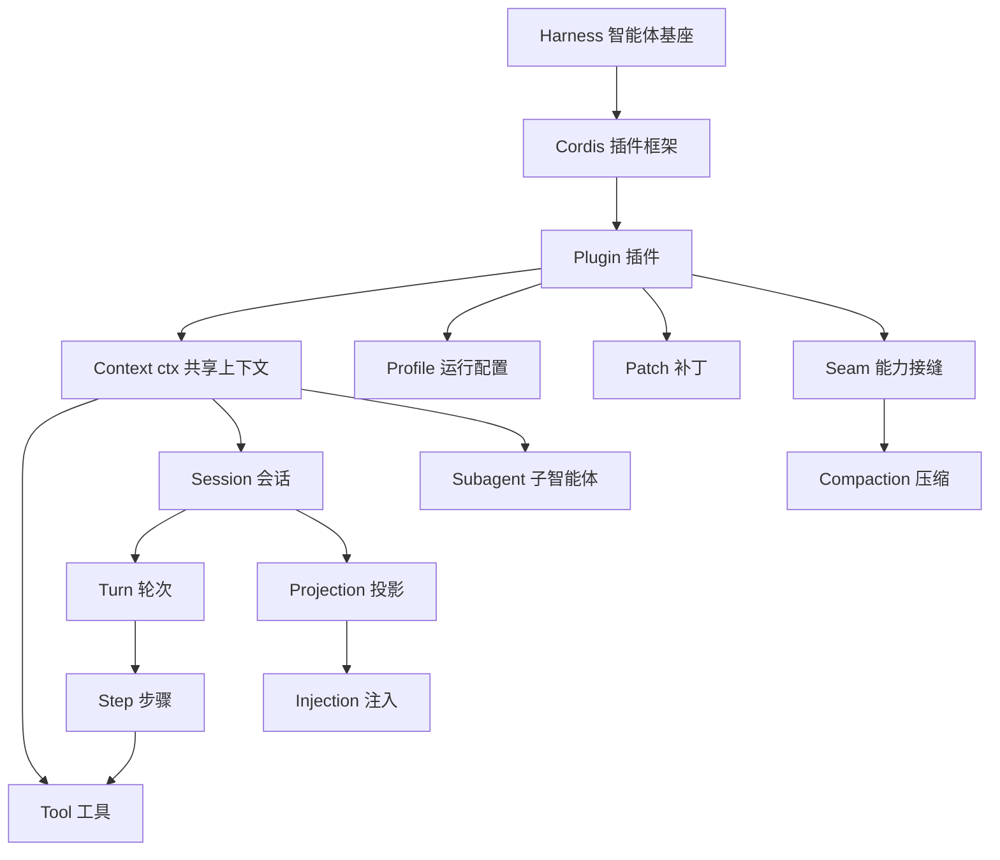

export const PATH = import.meta.env.BASE_URL;

export const TERMS = [
  { id: 'harness', cn: '智能体基座', en: 'Harness', desc: '承载大模型的运行底座：模型适配、工具调用、会话管理、Agent 循环都在其中。dsh 即 DeepSeek Harness。' },
  { id: 'plugin', cn: '插件', en: 'Plugin', desc: '导出 apply 函数的模块，向共享上下文注册能力。' },
  { id: 'context', cn: '上下文', en: 'Context / ctx', desc: 'Cordis 的共享上下文，插件通过它注册服务、监听事件、声明效果。' },
  { id: 'session', cn: '会话', en: 'Session', desc: '一次持续的人机协作；底层是一份只追加的事件日志。' },
  { id: 'turn', cn: '轮次', en: 'Turn', desc: '从零到多个 Step 构成；在“不再欠任何工作”时关闭。' },
  { id: 'step', cn: '步骤', en: 'Step', desc: '一次模型请求加上它所触发的工具调用。' },
  { id: 'tool', cn: '工具', en: 'Tool', desc: '面向模型的能力单元，注册到 ctx.tools。' },
  { id: 'profile', cn: '运行配置', en: 'Profile', desc: '一组命名好的插件树组合：web、headless、sdk、sdk-minimal、acp。' },
  { id: 'bundle', cn: '插件包', en: 'Bundle', desc: '可被 Profile 叠加的一组插件与补丁。' },
  { id: 'patch', cn: '补丁', en: 'Patch', desc: '覆盖层，按层序替换插件树中的配置。' },
  { id: 'seam', cn: '能力接缝', en: 'Seam', desc: '一个可替换能力的三角色契约：接口定义、提供者、消费者。' },
  { id: 'microkernel', cn: '微内核', en: 'Microkernel', desc: '没有特权核心的架构，一切皆插件。' },
  { id: 'cordis', cn: 'Cordis', en: 'Cordis', desc: 'DeepSeek Harness 的插件框架底座，提供 ctx、服务、事件与可逆效果。' },
  { id: 'reversible-effects', cn: '可逆效果', en: 'Reversible Effects', desc: '注册即效果，卸载即回退。' },
  { id: 'ptc', cn: '程序化工具调用', en: 'PTC / Programmatic Tool Calls', desc: '工具成为可编程 API，返回规范 JSON 而非渲染文本。' },
  { id: 'projection', cn: '投影', en: 'Projection', desc: '从会话日志派生模型上下文。' },
  { id: 'injection', cn: '注入', en: 'Injection', desc: 'agent.inject() 追加持久上下文，进入下一个模型请求。' },
  { id: 'compaction', cn: '压缩', en: 'Compaction', desc: '上下文压缩，一个可替换的能力接缝。' },
  { id: 'subagent', cn: '子智能体', en: 'Subagent', desc: '通过 ctx.subagents 委托的智能体分身。' },
];

本页把全书反复出现的术语集中在一处，并把它们之间的关系画成一张图。纸书版本见<a href={`${PATH}appendix/`}>附录 F 术语表</a>。

## 概念关系图

## 术语表

<dl class="stb-glossary">
  {TERMS.map((t) => (
    

      <dt id={t.id}>
        {t.cn}
        {t.en}
        <a class="stb-anchor" href={`#${t.id}`} aria-label="锚点">#</a>
      </dt>
      <dd>{t.desc}</dd>
    

  ))}
</dl>
